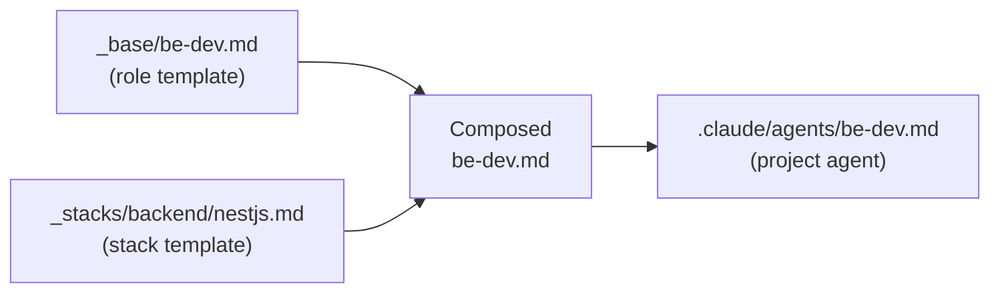
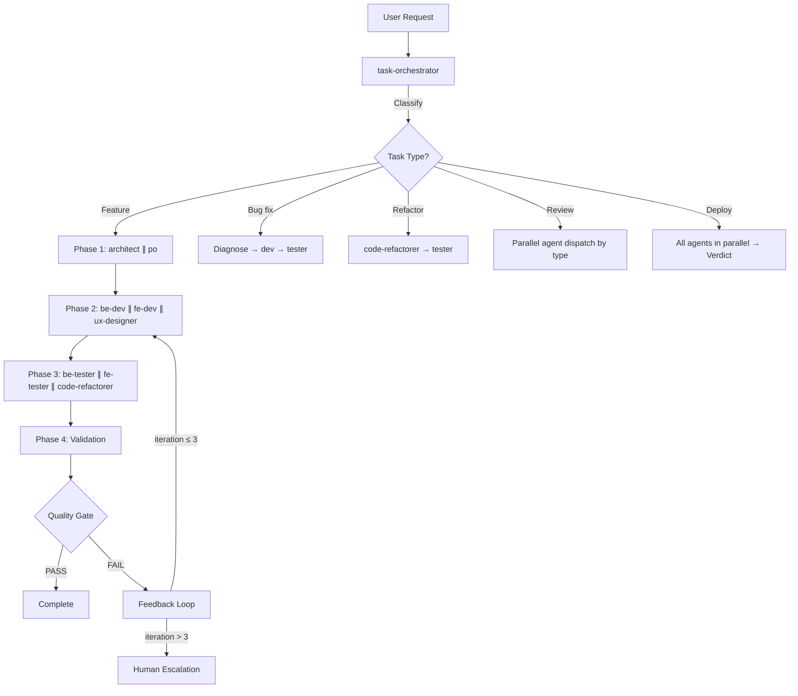
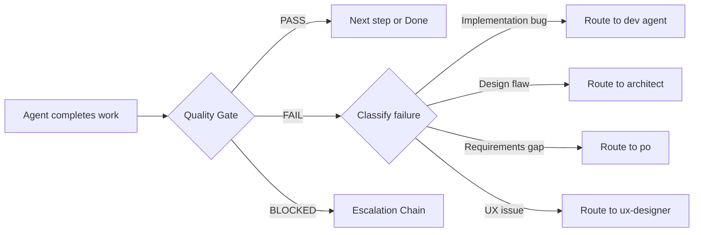

# Architecture

This document describes the multi-agent orchestration architecture of the **agentic-sdlc** plugin and its composable project scaffolding system.

---

## Two-Layer Design

The system separates concerns into two distinct layers:

### Plugin Layer (universal, reusable)

Lives in `.claude-plugin/` and is installed once per user. Contains agents, commands, hooks, and skills that apply to **any** project regardless of tech stack.

| Component | Location | Purpose |
|-----------|----------|---------|
| Plugin manifest | `.claude-plugin/plugin.json` | Metadata and registration |
| Orchestration agents | `agents/*.md` | Role-based specialists (stack-agnostic) |
| Workflow commands | `commands/*.md` | SDLC commands (`/feature`, `/review`, etc.) |
| Routing map | `commands/ROUTING_MAP.md` | Agent selection logic per command |
| Session hook | `hooks/hooks.json` + `hooks/session-start.sh` | Injects agent context on session start |
| Skills | `skills/*/SKILL.md` | Domain knowledge (project-docs, skill-developer) |

### Project Layer (stack-specific, generated)

Lives in the target project's `.claude/` directory. Generated by the CLI scaffolder from composable templates. Contains agents tailored to the project's exact tech stack.

| Component | Location | Purpose |
|-----------|----------|---------|
| Project agents | `.claude/agents/*.md` | Stack-specific devs and testers |
| Project commands | `.claude/commands/*.md` | Stack-aware commands (`/create`, `/fix`, etc.) |
| Project skills | `.claude/skills/` | Framework-specific guidelines |
| Settings | `.claude/settings.json` | Permissions and tool allowlists |
| Instructions | `.claude/CLAUDE.md` | Project conventions and context |

**Key principle**: Plugin agents orchestrate; project agents implement.

---

## Agent Composition Model

Project agents are composed from two template layers:

```
templates/agents/_base/       ← Role definition (what the agent does)
templates/agents/_stacks/     ← Stack instructions (how to do it with X framework)
```

### Composition Flow



The CLI scaffolder reads the base role template, replaces `{{BACKEND_STACK_INSTRUCTIONS}}` with the selected stack content, and writes a single clean agent file with no remaining placeholders.

### Placeholder Conventions

| Placeholder | Replaced By |
|-------------|-------------|
| `{{BACKEND_STACK_INSTRUCTIONS}}` | Backend framework patterns (e.g., NestJS, Go) |
| `{{FRONTEND_STACK_INSTRUCTIONS}}` | Frontend framework patterns (e.g., Next.js, Astro) |
| `{{TESTING_STACK_INSTRUCTIONS}}` | Testing framework patterns (e.g., Jest, Vitest) |
| `{{DATABASE_STACK_INSTRUCTIONS}}` | Database hosting specifics (e.g., Neon, Supabase) |
| `{{PROJECT_NAME}}`, `{{FRONTEND_FRAMEWORK}}`, etc. | Config template values |

---

## Orchestration Flow

The task-orchestrator coordinates all agent interactions:



### Execution Patterns

| Pattern | Description | Used By |
|---------|-------------|---------|
| Sequential Pipeline | Strict dependency chain | Feature phases |
| Parallel Fan-Out | Independent concurrent tasks | `/deploy`, `/review full` |
| Phased Parallel | Sequential phases, parallel within | `/feature` |
| Conditional Routing | Agent selection based on arguments | `/review [type]`, `/fix` |
| Iterative Refinement | Dev → Test → Feedback → Dev | Bug fixes, quality gates |

---

## Feedback Loop Architecture

Every implementation step passes through a quality gate:



### Escalation Matrix

| Trigger | Path | Action |
|---------|------|--------|
| 3 failed iterations | Agent → Orchestrator → Human | Full context summary |
| Ambiguous requirements | PO → Orchestrator → Human | List specific questions |
| Architecture conflict | Architect → Orchestrator → Human | Present options with trade-offs |
| Cross-cutting concern | Multiple agents → Orchestrator → Human | Coordination plan |
| Security concern | Any agent → Orchestrator → Human | Immediate flag |

See [FEEDBACK-LOOPS.md](./FEEDBACK-LOOPS.md) for the complete escalation protocol.

---

## Context Management Strategy

Claude Code's context window is a finite resource. The architecture manages it through:

### Subagent Isolation

Each specialist agent runs as a subagent with its own context window. This prevents one agent's analysis from consuming context needed by another.

### Narrow Scoping

When dispatching to agents, the orchestrator provides only the context relevant to that agent's task — not the entire project history.

### Iteration Limits

The hard cap of 3 iterations per feedback loop prevents runaway context consumption from repeated retry cycles.

### Progressive Disclosure in Skills

Skills keep their main file under 500 lines, deferring detail to `resources/` subdirectories that Claude reads on demand.

---

## Preset System

Presets control which project-level components are generated:

| Preset | Agents | Commands | Skills | Hooks |
|--------|--------|----------|--------|-------|
| Full SDLC | be-dev, fe-dev, be-tester, fe-tester | create, fix, test, debug | backend + frontend guidelines | post-tool-use-tracker, stop-build-check |
| Minimal | be-dev, fe-dev, be-tester, fe-tester | create, fix, test | backend + frontend guidelines | — |
| Prototype | be-dev, fe-dev | create, fix | backend + frontend guidelines | — |
| Backend Only | be-dev, be-tester | create, fix, test, debug | backend guidelines | post-tool-use-tracker, stop-build-check |
| Frontend Only | fe-dev, fe-tester | create, fix, test, debug | frontend guidelines | post-tool-use-tracker, stop-build-check |

---

## Directory Structure Overview

```
agentic-sdlc/
├── .claude-plugin/
│   └── plugin.json              # Plugin manifest
├── agents/                      # Plugin agents (universal)
│   ├── task-orchestrator.md
│   ├── architect.md
│   ├── po.md
│   ├── code-refactorer.md
│   └── ux-designer.md
├── commands/                    # Plugin commands (universal)
│   ├── feature.md
│   ├── review.md
│   ├── improve.md
│   ├── analyze.md
│   ├── deploy.md
│   └── ROUTING_MAP.md
├── hooks/                       # Plugin hooks
│   ├── hooks.json
│   └── session-start.sh
├── skills/                      # Plugin skills
│   ├── project-docs/
│   └── skill-developer/
├── templates/                   # Composable templates for CLI
│   ├── agents/_base/            # Role templates
│   ├── agents/_stacks/          # Stack-specific content
│   ├── commands/                # Project command templates
│   ├── config/                  # CLAUDE.md, settings.json templates
│   ├── hooks/                   # Project hook templates
│   ├── presets/                 # Preset definitions
│   └── skills/                  # Skill templates
├── cli/                         # CLI scaffolder (npx create-agentic-project)
├── docs/                        # Documentation
└── prompts/                     # Prompt library
```
