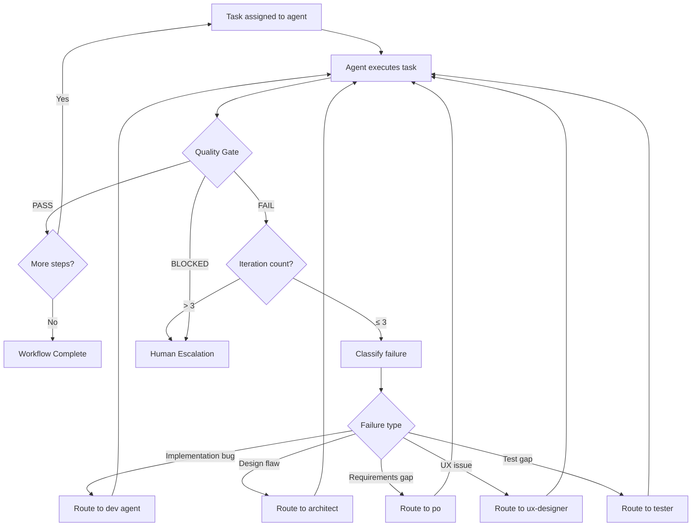

# Feedback Loops

The agentic-sdlc system uses structured feedback loops to ensure quality without runaway iteration. Every implementation step passes through a quality gate, and failures are classified and routed to the appropriate agent for resolution.

---

## Orchestrator Feedback Loop



---

## Escalation Matrix

The response to a failure depends on both the **failure type** and the **iteration number**:

| Failure Type | Iteration 1 | Iteration 2 | Iteration 3 | After Iteration 3 |
|-------------|-------------|-------------|-------------|-------------------|
| **Implementation bug** | Route to dev with error context | Route to dev with prior attempt summary | Route to dev with explicit guidance | Escalate to human |
| **Test failure** | Route to tester with failure output | Route to dev (may be implementation issue) | Route to architect (may be design issue) | Escalate to human |
| **Design flaw** | Route to architect with concerns | Route to architect with constraints | Escalate to human (ambiguity likely) | — |
| **Requirements gap** | Route to po for clarification | Escalate to human (po cannot resolve alone) | — | — |
| **Integration conflict** | Route to both affected agents | Route to architect for mediation | Escalate to human | — |
| **Performance regression** | Route to dev with profiling data | Route to architect (may need design change) | Escalate to human | — |
| **Security concern** | Escalate to human immediately | — | — | — |

### Key Observations

- **Security concerns** always escalate immediately — no iteration.
- **Requirements gaps** escalate faster (iteration 2) because continued guessing wastes context.
- **Implementation bugs** get the full 3 iterations since they are usually solvable.
- **Test failures** shift responsibility upward (tester → dev → architect) as iterations increase.

---

## Max 3 Iterations Policy

### The Rule

Any single feedback loop is capped at **3 iterations**. After the third failed attempt on the same issue, the orchestrator must escalate to the human.

### Rationale

1. **Context preservation** — Each iteration consumes context window. Three attempts are enough to explore reasonable solutions without exhausting context.
2. **Diminishing returns** — If three attempts with feedback have not resolved an issue, the root cause is likely outside the agent's knowledge or the requirements are genuinely ambiguous.
3. **Avoiding loops** — Without a hard cap, agents can enter infinite retry cycles that consume time and context without progress.
4. **Signal to human** — Repeated failure is valuable signal. It tells the human exactly where the system needs guidance.

### What Counts as an Iteration?

An iteration is one complete cycle of: agent receives task → agent produces output → quality gate evaluates output → result is FAIL. The counter is per-issue, not per-agent. If a failure is reclassified and routed to a different agent, the iteration counter carries over.

---

## Human Escalation Protocol

When the 3-iteration limit is reached or an immediate escalation trigger fires, the orchestrator must:

### 1. Summarise Context

```
## Escalation: [Issue Title]

**Attempts**: 3 of 3
**Agents involved**: [list]
**Original task**: [description]
```

### 2. Detail Each Attempt

```
### Attempt 1 — [Agent]
- **Approach**: [what was tried]
- **Result**: [what failed and why]

### Attempt 2 — [Agent]
- **Approach**: [adjusted approach]
- **Result**: [what failed and why]

### Attempt 3 — [Agent]
- **Approach**: [final approach]
- **Result**: [what failed and why]
```

### 3. Identify the Root Blocker

State the likely root cause: ambiguous requirements, missing domain knowledge, conflicting constraints, or a genuine technical limitation.

### 4. Recommend a Path Forward

Provide 1–3 concrete options the human can choose from, including trade-offs for each.

---

## Feedback Message Format

When routing a failure back to an agent, the orchestrator includes structured feedback:

```markdown
## Feedback from [Source Agent/Gate]

**Status**: FAIL
**Issue**: [Clear description of what failed]
**Evidence**: [Test output, error messages, or specific concerns]
**Previous attempts**: [N of 3]
**Guidance**: [Specific direction for the fix — not just "try again"]
```

This format ensures agents have sufficient context to adjust their approach rather than repeating the same mistake.
